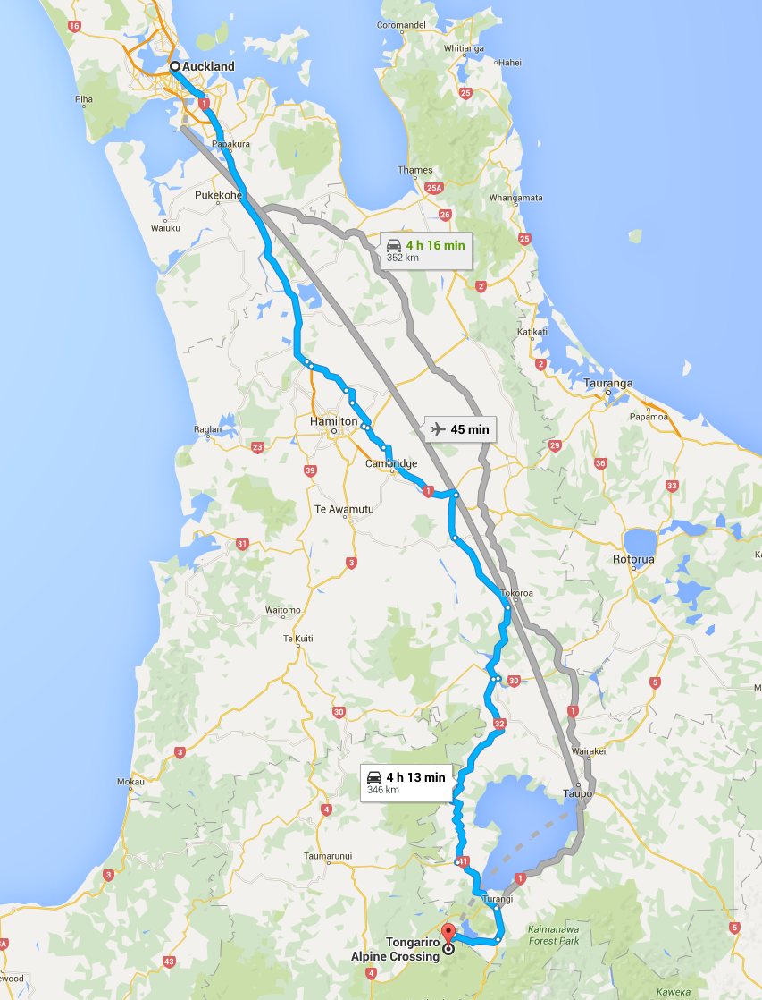

# Tongariro Alpine Crossing Walk

## Summary

The Tongariro Alpine Crossing in Tongariro National Park is a tramping track in New Zealand, and is among the most popular day hikes in the country. The Tongariro National Park is a World Heritage site which has the distinction of dual status, as it has been acknowledged for both its natural and cultural significance.

The crossing passes over the volcanic terrain of the multi-cratered active volcano Mount Tongariro, passing the eastern base of Mount Ngauruhoe which can optionally be climbed as a side trip.

The full distance of the track is usually 19.4-kilometre (12.1 mi).

## Details

* Duration: 7-9hrs
* One Way (Transportation at start/finish required)
* Unpredictable weather, plan accordingly

## Summits

Mountain summit trails are not included as part of the *crossing* walk trail. These are separate trails off the main route.

### Mt. Ngauruhoe

#### Details

* Trail begins at South Crater with signpost for Ngauruhoe Summit
* Elevation gain: 650m from South Crater
* Active Volcano
* Grade: 30 degrees
* Hiking boots over trainers/trail runners *highly* recommended
* Duration: 1.5 - 2.5 hours

###  Mt. Tongariro

#### Details

* Begins at signpost for Tongariro Summit at Red Crater
* Elevation gain: ~100m from Red Crater
* Duration: 1.5 - 2.0 hours

## Trail Map

## Elevation Map

## Location

* Auckland - ~350km (4h 13m) - [Directions](https://goo.gl/maps/LxTzxhATTcC2)

## Related Links

* http://www.tongarirocrossing.org.nz/
* https://en.wikipedia.org/wiki/Tongariro_Alpine_Crossing
* http://www.newzealand.com/us/feature/tongariro-alpine-crossing/
* http://www.doc.govt.nz/parks-and-recreation/places-to-go/central-north-island/places/tongariro-national-park/things-to-do/tracks/mount-ngauruhoe-summit-climb/
* http://www.tongarironationalpark.com/tongariro-national-park/tongariro-mountain-summits.html

