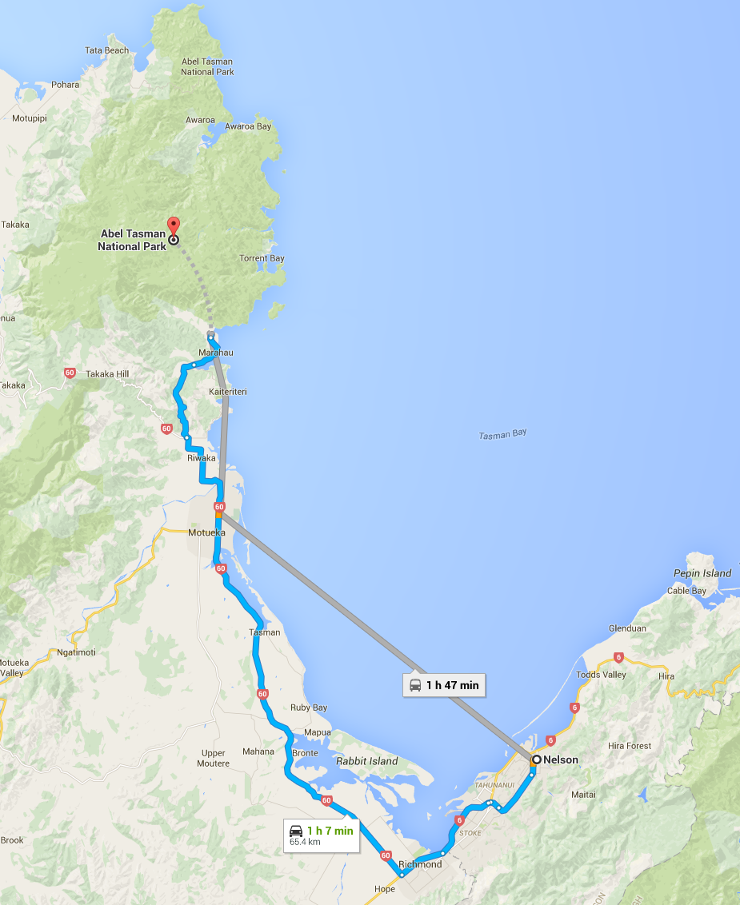

# Abel Tasman National Park

Abel Tasman National Park is renowned for its golden beaches, sculptured granite cliffs, and its world-famous coast track.

## One Day Hiking

* [Wainui Falls Track](wainui-falls.md)
* [Harwoods Hole Track](harwoods-hole.md)
* [Totaranui Walks](totaranui-walks.md)
* [Gibbs Hill Track](gibbs-hill.md)

## Multi-Day Hiking

* [Inland Track](inland-track.md)
* [Abel Tasman Coast Track (Great Walk)](abel-tasman-coast-track.md)

## Location

* Nelson - ~65km (1h 8m) - [Directions](https://goo.gl/maps/bbutBsraXd32)

## Related Links

* https://www.abeltasman.co.nz/
* http://www.doc.govt.nz/parks-and-recreation/places-to-go/nelson-tasman/places/abel-tasman-national-park/
* http://www.abyssalplains.com/2013/05/kayaking-along-northern-shores-of-new.html