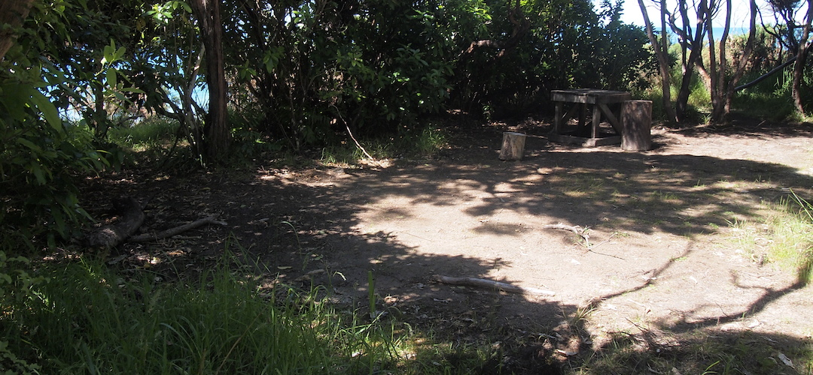
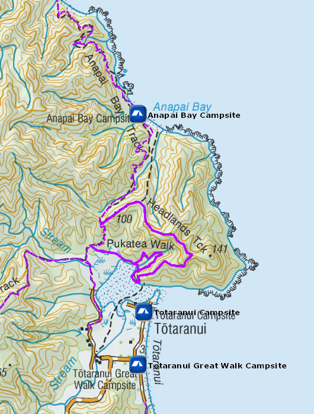
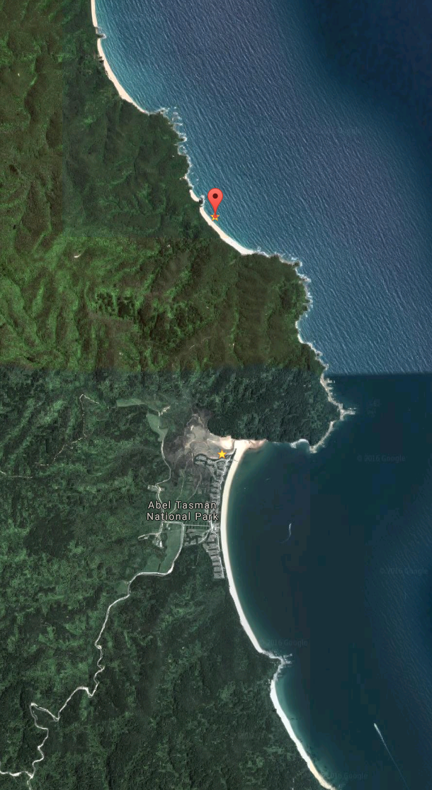

# Anapai Bay Campsite

Walk-in or boat-in to this beachside campsite on the Waiharakeke to Whariwharangi section of the Abel Tasman Coast Track. There is no drive-in access.

The area around Anapai is one of the most dramatic in Abel Tasman, those rock formations are speccy, and the Anapai Bay campsite in the kanuka and mahoe shrubbery has more shelter than the famous Mutton Cove not so far away.

Details:
* Booking: Required
* Cost: $14/night
* Sites: 6
* Location: NZTM2000 coordinates: E1600360, N5483142 -- Latitude: 40 48 09.807 S, Longitude: 173 00 15.362 E
* Facilities: picnic table - tap on post, treating water recommended - longdrop
* Fire: No

Contact: [Nelson Visitor Centre](contacts.md#nelson-visitor-centre)

### Grounds

### Topo Map

### Google Earth

## Related Links
* http://www.doc.govt.nz/parks-and-recreation/places-to-go/nelson-tasman/places/abel-tasman-national-park/things-to-do/campsites/anapai-bay-campsite/
* http://www.tramping.net.nz/huts-abel-tasman-coastal/anapai-bay-campsite-coastal-track-abel-tasman