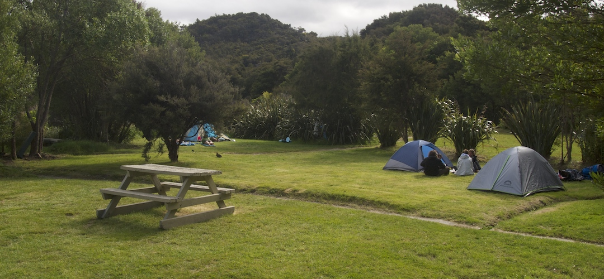
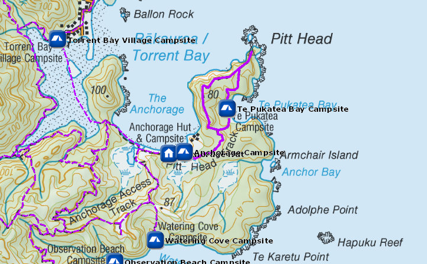
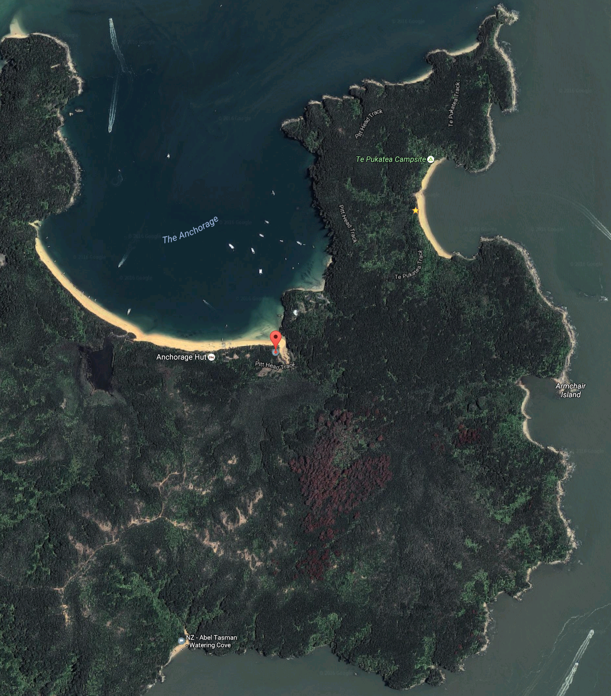

# Anchorage Campsite

Walk-in or boat-in to this beachside campsite on the Tinline to Anchorage section of the Abel Tasman Coast Track. There is no drive on access.

Anchorage has great facilities, but is also quite busy. It is especially busy in summer with pick-ups of kayaks and day walkers by water taxis. It is a scheduled water taxi stop.

Anchorage campsite. Photo: Diana Parr.
Anchorage campsite
It is a popular campsite for school groups, especially on Monday to Thursday nights in November and mid-February to April.

The campsite gets good winter sun, has a fireplace, and sinks for hand-washing.

Details:
* Booking: Required
* Cost: $14/night
* Sites: 50
* Location: NZTM2000 coordinates: E1604997, N5466045 -- Latitude: 40 57 24.214 S, Longitude: 173 03 33.758 E
* Facilities: kitchen shelter with sinks -- tap inside, filtered water available -- flush toilet
* Fire: Yes

Contact: [Nelson Visitor Centre](contacts.md#nelson-visitor-centre)

### Grounds

### Topo Map

### Google Earth

## Related Links
* http://www.doc.govt.nz/parks-and-recreation/places-to-go/nelson-tasman/places/abel-tasman-national-park/things-to-do/campsites/anchorage-campsite/
* http://www.tramping.net.nz/huts-abel-tasman-coastal/anchorage-campsite-coastal-track-abel-tasman