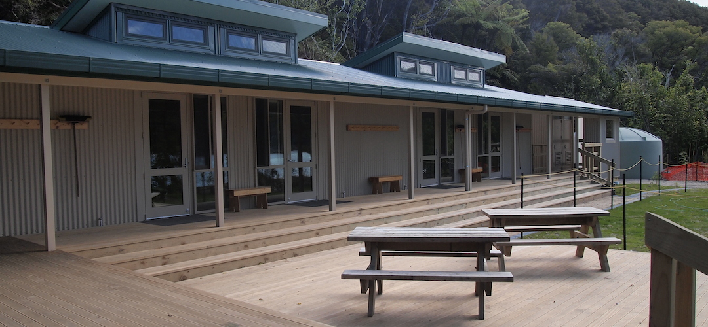
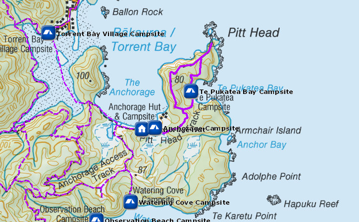
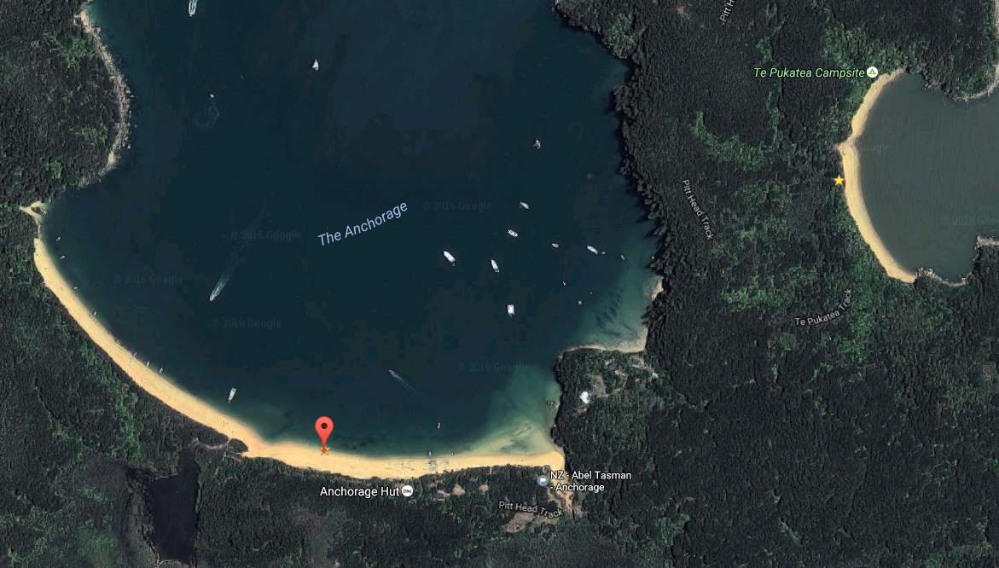

# Anchorage Hut

Huts on the Abel Tasman Coast Track don't have gas cooking facilities and lighting. Remember to take a portable stove and fuel, and candles with you.

Smack on the splendid north facing beach, just unveiled in October 2013, Anchorage Hut is genuine five star accommodation, ie, flush toilets, double glazed, filtered water, four separate bedrooms, etc.

Basically so-called backcountry huts don’t come any more luxurious than this.

Details:
* Booking: Required
* Cost: $32/night
* Sites: 24 (4 rooms)
* Location: NZTM2000 coordinates: E1604713, N5466085 -- Latitude: 40 57 22.923 S, Longitude: 173 03 21.608 E
* Facilities: tap inside, filtered water available -- flush toilet
* Fire: Yes

Contact: [Nelson Visitor Centre](contacts.md#nelson-visitor-centre)

### Grounds

### Topo Map

### Google Earth

## Related Links
* http://www.doc.govt.nz/parks-and-recreation/places-to-go/nelson-tasman/places/abel-tasman-national-park/things-to-do/huts/anchorage-hut/
* http://www.tramping.net.nz/huts-abel-tasman-coastal/anchorage-hut-coastal-track-abel-tasman
