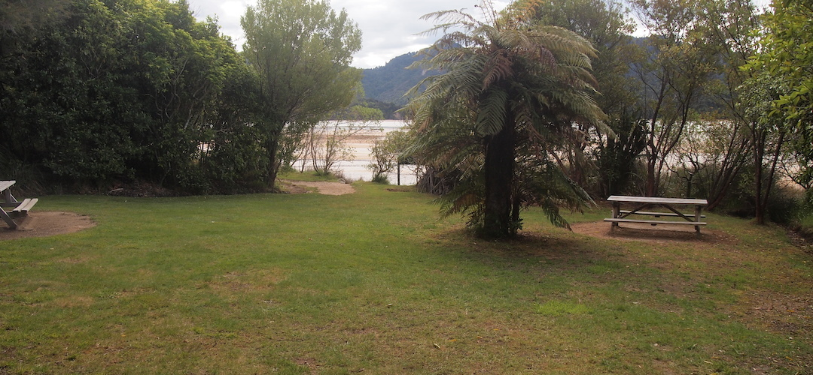
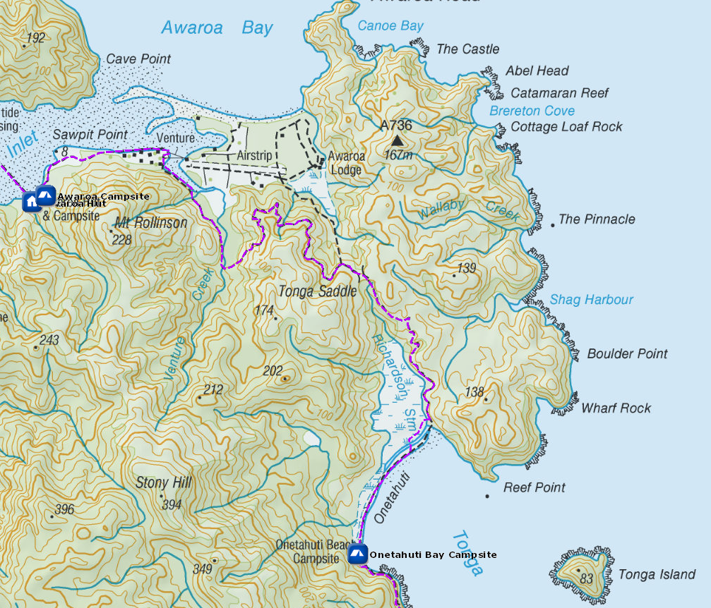
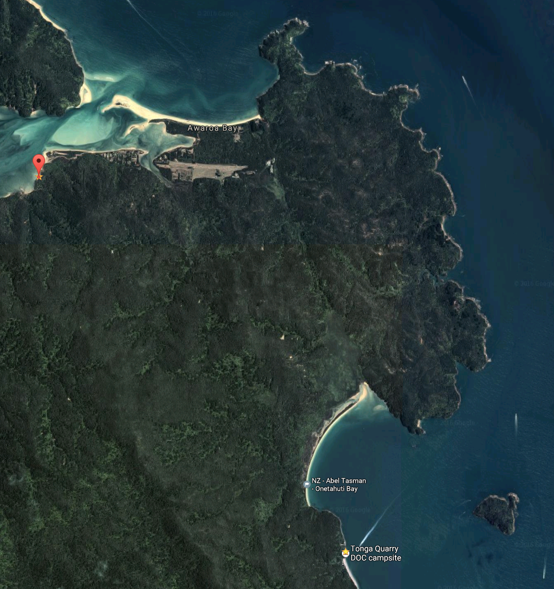

# Awaroa Campsite

Walk-in or boat-in to this campsite on the Mosquito Bay to Awaroa section of the Abel Tasman Coast Track. There is no drive on access.

The Awaroa Campsite is situated beside an beside an estuary on the Abel Tasman Coast Track. It gets good winter sun

There are hand-washing sinks, and a fireplace (although this is often closed due to fire danger).

Awaroa campsite is sheltered and sunny, at least when the sun is shining, with a full range of facilities, adjacent to the Awaroa Hut and estuary.

Details:
* Booking: Required
* Cost: $14/night
* Sites: 18
* Location: NZTM2000 coordinates: E1601584, N5476252 -- Latitude: 40.86479166 S, Longitude: 173.01879602 E
* Facilities: shelter - sink with tap, filtered water - flush toilet
* Fire: Yes

Contact: [Nelson Visitor Centre](contacts.md#nelson-visitor-centre)

### Grounds

### Topo Map

### Google Earth

## Related Links
* http://www.doc.govt.nz/parks-and-recreation/places-to-go/nelson-tasman/places/abel-tasman-national-park/things-to-do/campsites/awaroa-campsite/
* http://www.tramping.net.nz/huts-abel-tasman-coastal/awaroa-campsite-coastal-track-abel-tasman
