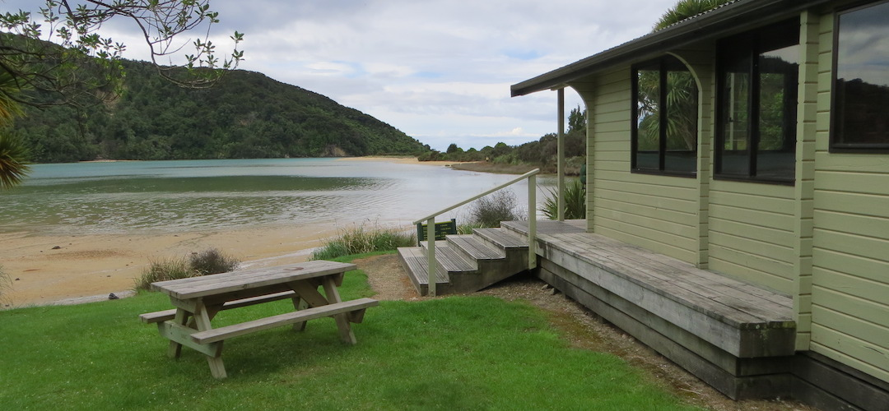
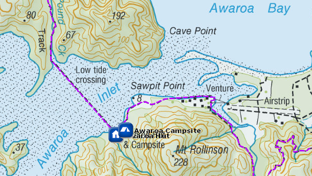
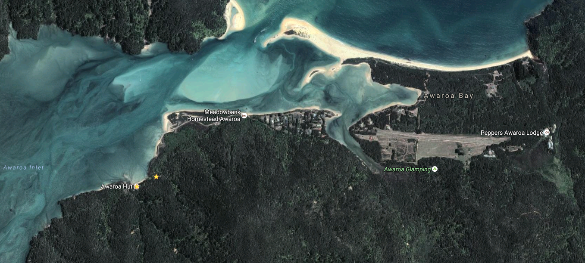

# Awaroa Hut

This is a 26-bunk hut located on the Abel Tasman Coast Track in the Golden Bay area.

Huts on the Abel Tasman Coast Track don't have gas cooking facilities and lighting. Remember to take a portable stove and fuel, and candles with you.

Awaroa Hut is parked on the Awaroa estuary, it’s handy while waiting for that tide to recede, that’s if you’re on the hut side, if not, you can at least look at it and dream you are there.

Details:
* Booking: Required
* Cost: $32/night
* Sites: 26 (2 rooms)
* Location: NZTM2000 coordinates: E1601483, N5476200 -- Latitude: 40 51 54.938 S, Longitude: 173 01 03.351 E
* Facilities: shelter - sink with tap, filtered water - flush toilet
* Fire: Yes

Contact: [Nelson Visitor Centre](contacts.md#nelson-visitor-centre)

### Grounds

### Topo Map

### Google Earth

## Related Links
* http://www.doc.govt.nz/parks-and-recreation/places-to-go/nelson-tasman/places/abel-tasman-national-park/things-to-do/huts/awaroa-hut/
* http://www.tramping.net.nz/huts-abel-tasman-coastal/awaroa-hut-coastal-track-abel-tasman