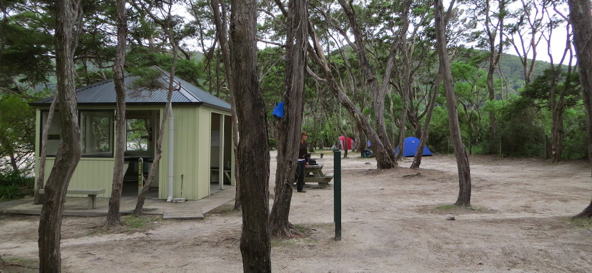
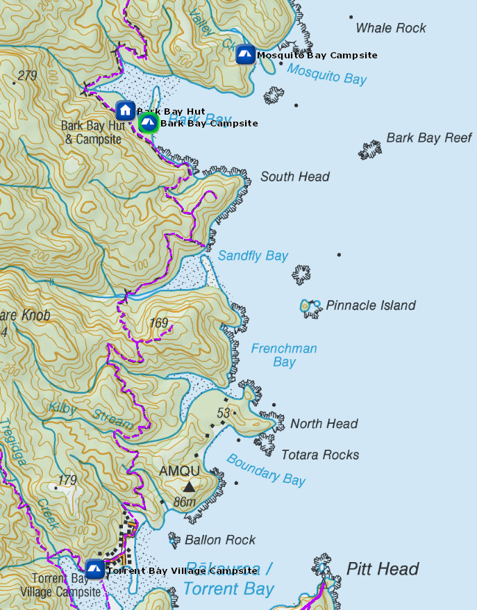
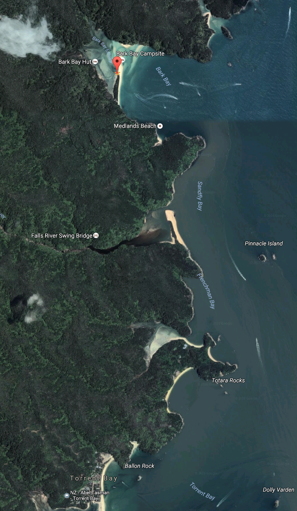

# Bark Bay Campsite

Walk-in or boat-in to this beachside campsite on the Torrent Bay Estuary to Bark Bay section of the Abel Tasman Coast Track. There is no drive on access.

Bark Bay is a popular campsite for school groups, especially on Monday to Thursday nights in November and mid-February to April.

It has a fireplace, gets good winter sun, and is a scheduled water taxi stop.

The Bark Bay campsite is a big campsite with plenty of facilities set in kanuka scrub and set back from the big beach. A place to meet plenty of people in the summer months.

Details:
* Booking: Required
* Cost: $14/night
* Sites: 40
* Location: NZTM2000 coordinates: E1604269, N5470462 -- Latitude: 40 55 00.987 S, Longitude: 173 03 02.506 E
* Facilities: shelter -- tap sink, filtered water available -- flush toilet
* Fire: Yes

Contact: [Nelson Visitor Centre](contacts.md#nelson-visitor-centre)

### Grounds

### Topo Map

### Google Earth

## Related Links
* http://www.doc.govt.nz/parks-and-recreation/places-to-go/nelson-tasman/places/abel-tasman-national-park/things-to-do/campsites/bark-bay-campsite/
* http://www.tramping.net.nz/huts-abel-tasman-coastal/bark-bay-campsite-coastal-track-abel-tasman