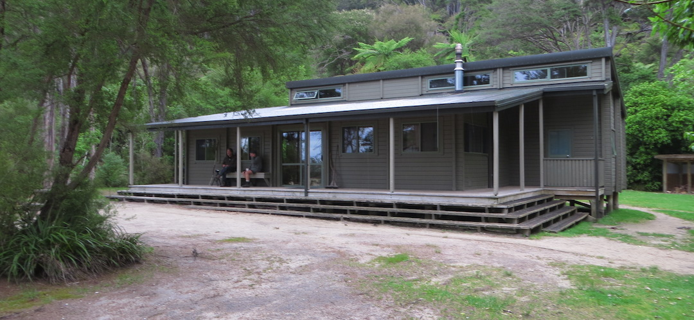
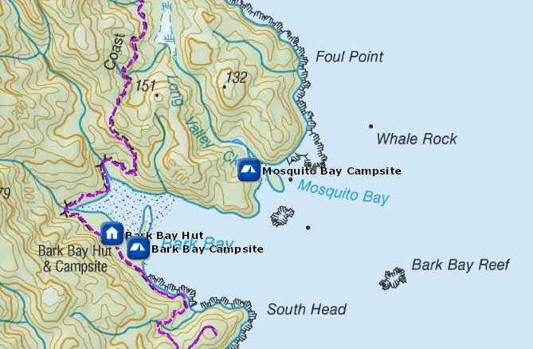
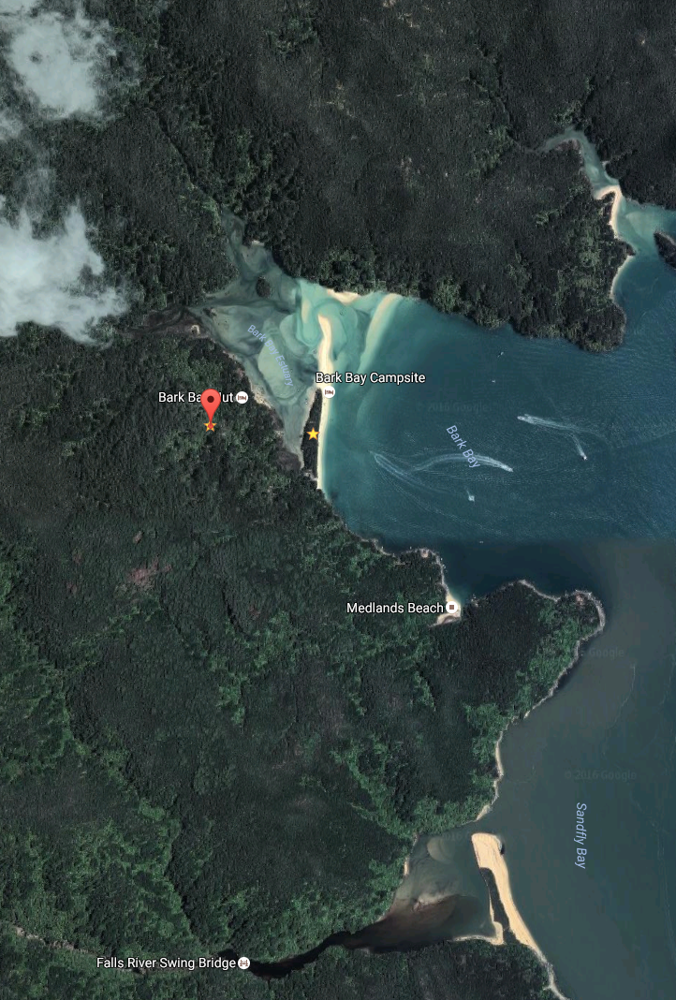

# Bark Bay Hut

This is a 34-bunk hut located on the Abel Tasman Coast Track in the Motueka area.

Bark Bay Hut is set back from the Bark Bay Beach, on the other side of the estuary, this is a reminder of how the huts in Abel Tasman used to be, comfortable and well equipped sufficiently, when it’s not totally chokka.

Details:
* Booking: Required
* Cost: $32/night
* Sites: 32 (two rooms)
* Location: NZTM2000 coordinates: E1604013, N5470482 -- Latitude: 40 55 00.343 S, Longitude: 173 02 51.561 E
* Facilities: shelter -- tap sink, filtered water available -- flush toilet
* Fire: Yes

Contact: [Nelson Visitor Centre](contacts.md#nelson-visitor-centre)

### Grounds

### Topo Map

### Google Earth

## Related Links
* http://www.doc.govt.nz/parks-and-recreation/places-to-go/nelson-tasman/places/abel-tasman-national-park/things-to-do/huts/bark-bay-hut/
* http://www.tramping.net.nz/huts-abel-tasman-coastal/bark-bay-hut-coastal-track
