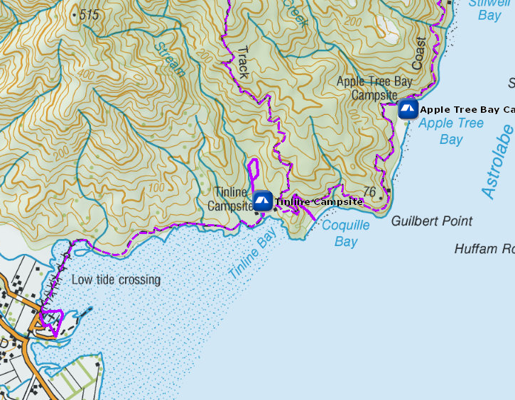

# Coquille Bay Campsite

Walk-in or boat-in to this beachside campsite on the Tinline to Anchorage section of the Abel Tasman Coast Track. There is no drive on access.

Details:
* Booking: Required
* Cost: $14/night
* Sites: 6
* Location: NZTM2000 coordinates: E1602482, N5462421 -- Latitude: S40° 59.363', Longitude: E173° 01.771'
* Facilities: Tap water
* Fire: No?

Contact: [Nelson Visitor Centre](contacts.md#nelson-visitor-centre)

### Grounds

### Topo Map

### Google Earth

## Related Links
* http://www.doc.govt.nz/parks-and-recreation/places-to-go/nelson-tasman/places/abel-tasman-national-park/things-to-do/campsites/coquille-bay-campsite/
