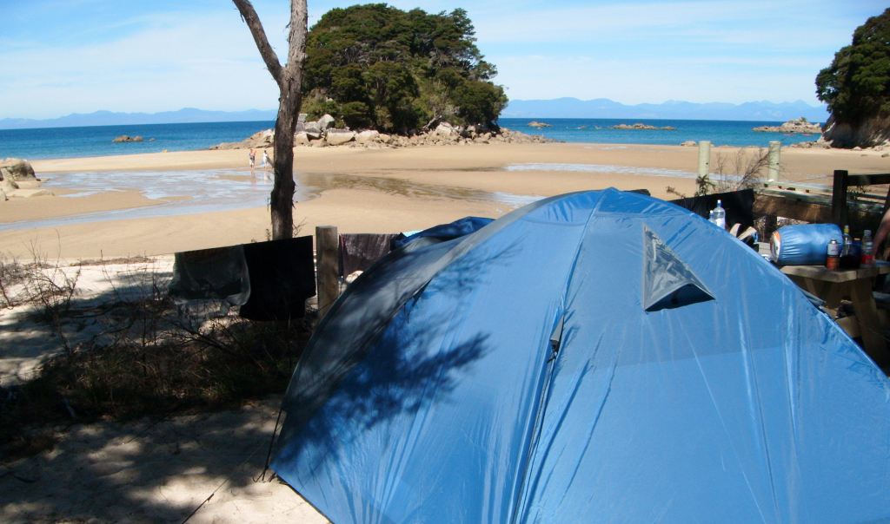
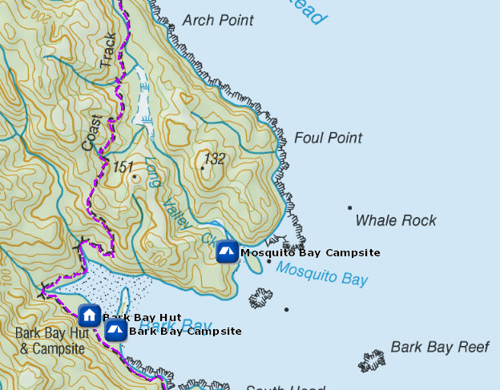
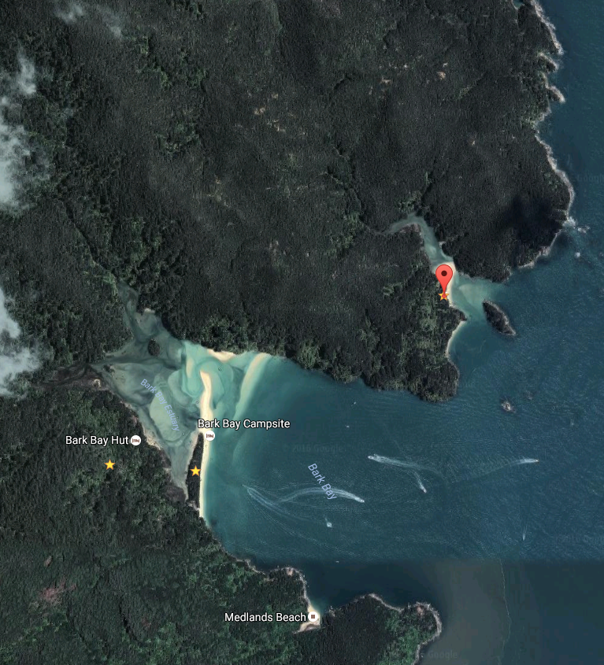

# Mosquito Bay Campsite

Boat-in to this beachside campsite on the Mosquito Bay to Awaroa section of the Abel Tasman Coast Track. There is no drive on or walk-in access.

Access to this campsite is by boat-in only. There is no track to Mosquito Bay from the main Abel Tasman Coast track.

Mosquito Bay gets good winter sun.

Details:
* Booking: Required
* Cost: $14/night
* Sites: 20
* Location: NZTM2000 coordinates: E1605005, N5470980 -- Latitude: 40 54 44.173 S, Longitude: 173 03 33.957 E
* Facilities: ?
* Fire: ?

Contact: [Nelson Visitor Centre](contacts.md#nelson-visitor-centre)

### Grounds

### Topo Map

### Google Earth

## Related Links
* http://www.doc.govt.nz/parks-and-recreation/places-to-go/nelson-tasman/places/abel-tasman-national-park/things-to-do/campsites/mosquito-bay-campsite-campsite/
* http://marklockitt.com/travel/australasia/new-zealand/top-things-to-do-in-new-zealand-south-island/