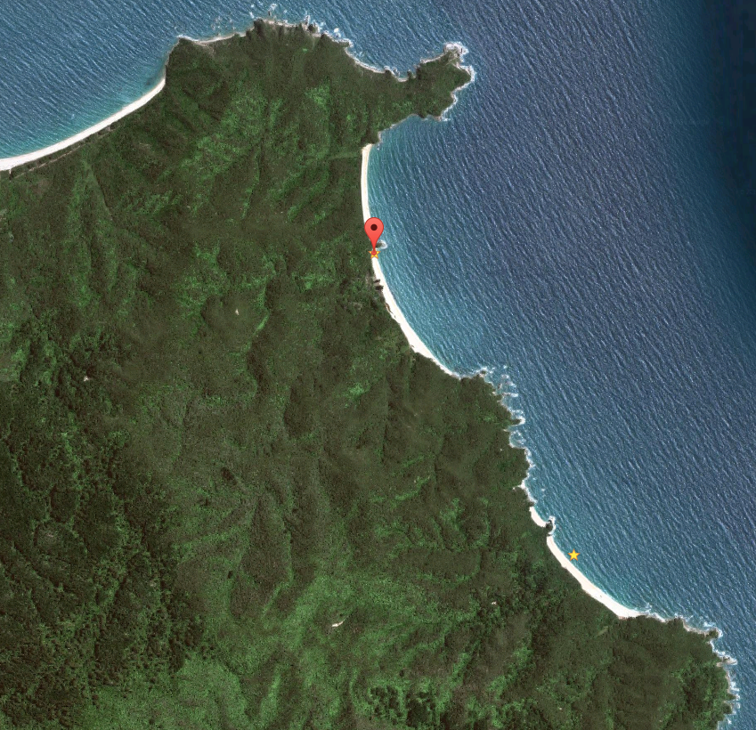

# Mutton Cove Campsite

Walk-in or boat-in to this beachside campsite on the Waiharakeke to Whariwharangi section of the Abel Tasman Coast Track. There is no drive on access.

Mutton Cove campsite is widely regarded as the most attractive campsite in the national park, perched just above a golden beach, with that pure, clear water. Who am I to dispute that?

Details:
* Booking: Required
* Cost: $14/night
* Sites: 20
* Location: NZTM2000 coordinates: E1599494, N5484453 -- Latitude: 40 47 27.292 S, Longitude: 172 59 38.406 E
* Facilities: shelter - tap on post, treating water recommended - flush toilet
* Fire: Yes

Contact: [Nelson Visitor Centre](contacts.md#nelson-visitor-centre)

### Grounds

### Topo Map

### Google Earth

## Related Links
* http://www.doc.govt.nz/parks-and-recreation/places-to-go/nelson-tasman/places/abel-tasman-national-park/things-to-do/campsites/mutton-cove-campsite/
* http://www.tramping.net.nz/huts-abel-tasman-coastal/mutton-cove-campsite-coastal-track-abel-tasman
