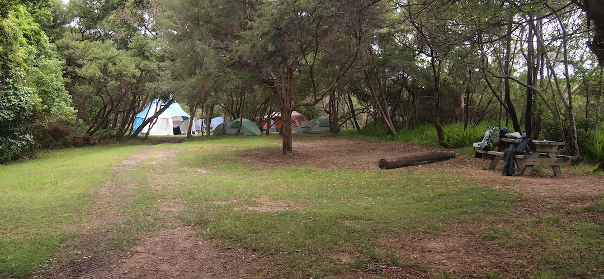
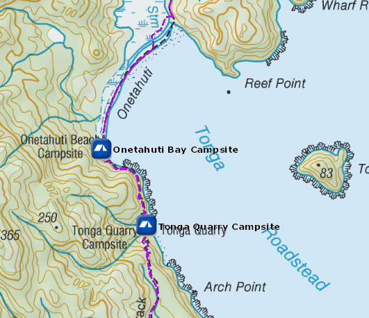
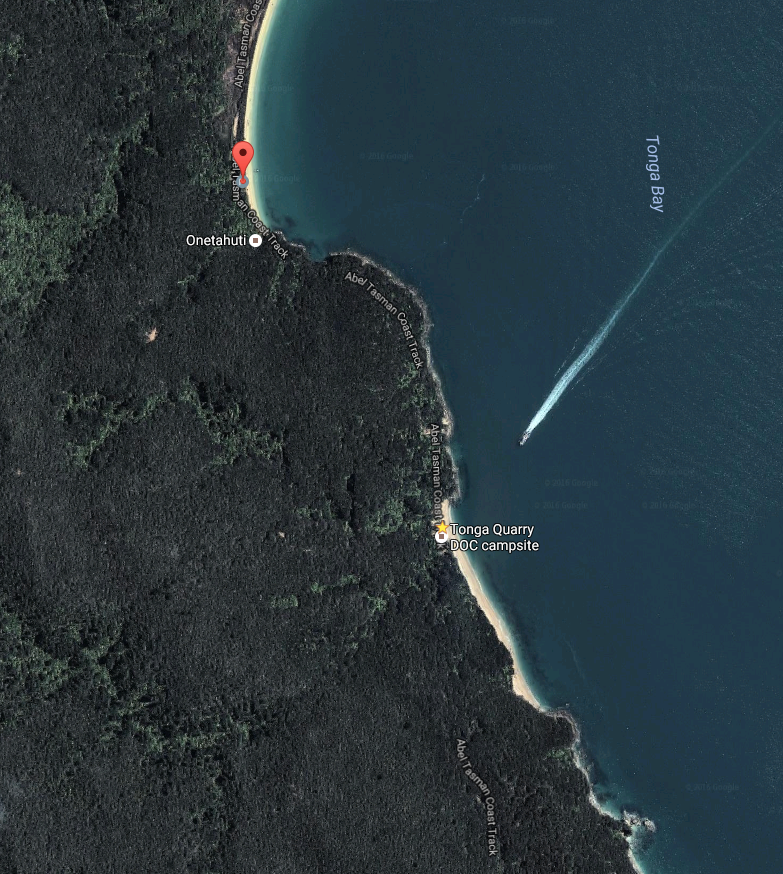

# Onetahuti Bay Campsite

Walk-in or boat-in to this beachside campsite on the Mosquito Bay to Awaroa section of the Abel Tasman Coast Track. There is no drive on access.

Onetahuti Bay can be accessed by Onetahuti Bridge. It is also a scheduled water taxi stop.

Onetahuti Bay campsite is a sheltered, grassy, campsite close to a big beach. Nice one.

Details:
* Booking: Required
* Cost: $14/night
* Sites: 20
* Location: NZTM2000 coordinates: E1604012, N5473562 -- Latitude: 40.88900745 S, Longitude: 173.046603585 E
* Facilities: shelter - sink with tap - flush toilet
* Fire: No

Contact: [Nelson Visitor Centre](contacts.md#nelson-visitor-centre)

### Grounds

### Topo Map

### Google Earth

## Related Links
* http://www.doc.govt.nz/parks-and-recreation/places-to-go/nelson-tasman/places/abel-tasman-national-park/things-to-do/campsites/onetahuti-bay-campsite/
* http://www.tramping.net.nz/huts-abel-tasman-coastal/onetahuti-bay-campsite-coastal-track-abel-tasman
