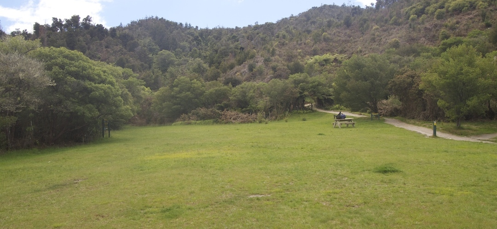
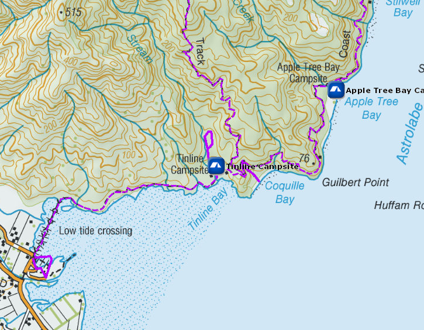
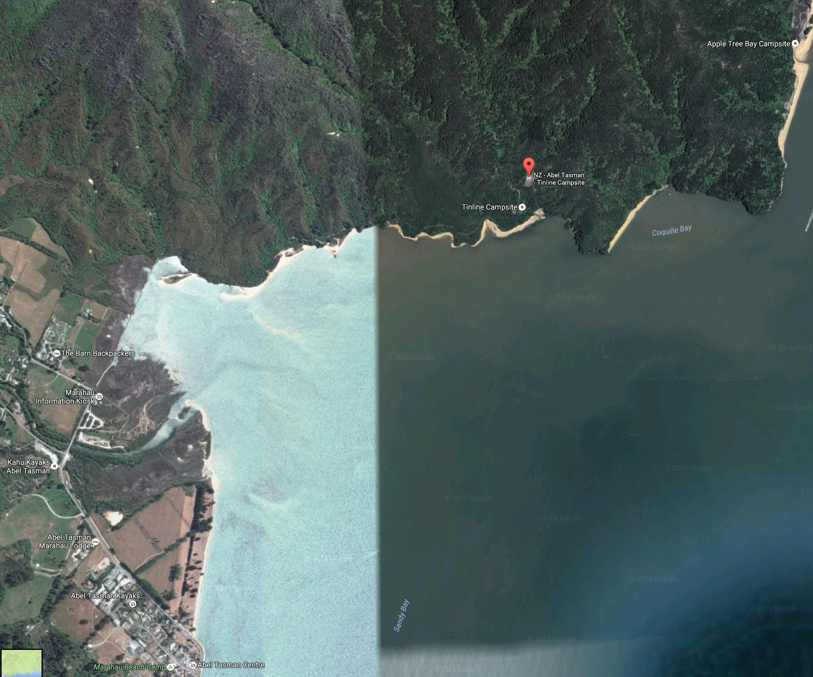

# Tinline Campsite

Walk-in or boat-in to this inland campsite on the Tinline to Anchorage section of the Abel Tasman Coast Track. There is no drive on access.

Tinline campsite is the closest campsite to Marahau has not so much to recommend it: it’s not adjacent to the beach, it’s on a considerable slope, plenty exposed, ie, no shade, although there are a few better sites nestled adjacent to the shrubbery.

Details:
* Booking: Required
* Cost: $14/night
* Sites: 15
* Location: NZTM2000 coordinates: E1602084, N5462518 -- Latitude: 40 59 18.639 S, Longitude: 173 01 29.191 E
* Facilities: shelter with small stainless steel bench top with sink and bench seat -- tap on post, treating water recommended -- longdrop
* Fire: No

Contact: [Nelson Visitor Centre](contacts.md#nelson-visitor-centre)

### Grounds

### Topo Map

### Google Earth

## Related Links
* http://www.doc.govt.nz/parks-and-recreation/places-to-go/nelson-tasman/places/abel-tasman-national-park/things-to-do/campsites/tinline-campsite/
* http://www.tramping.net.nz/huts-abel-tasman-coastal/tinline-campsite-coastal-track-abel-tasman
