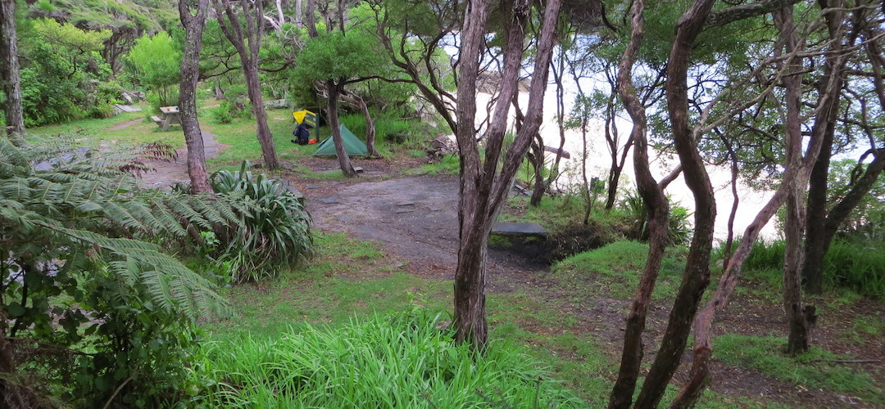
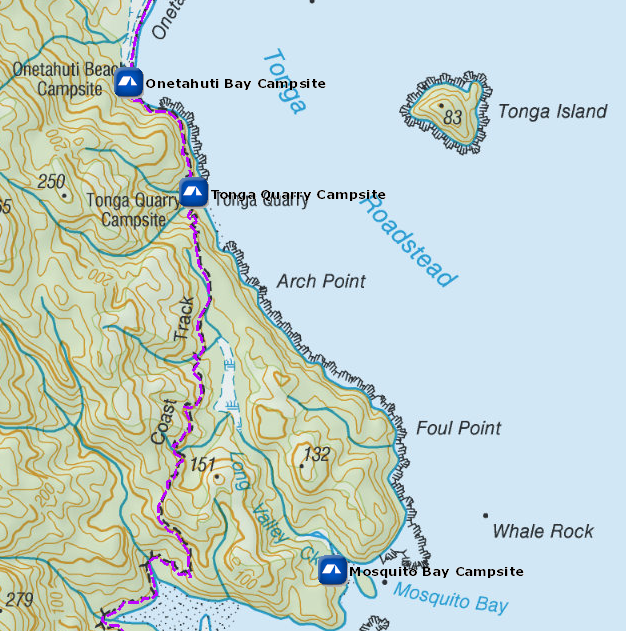
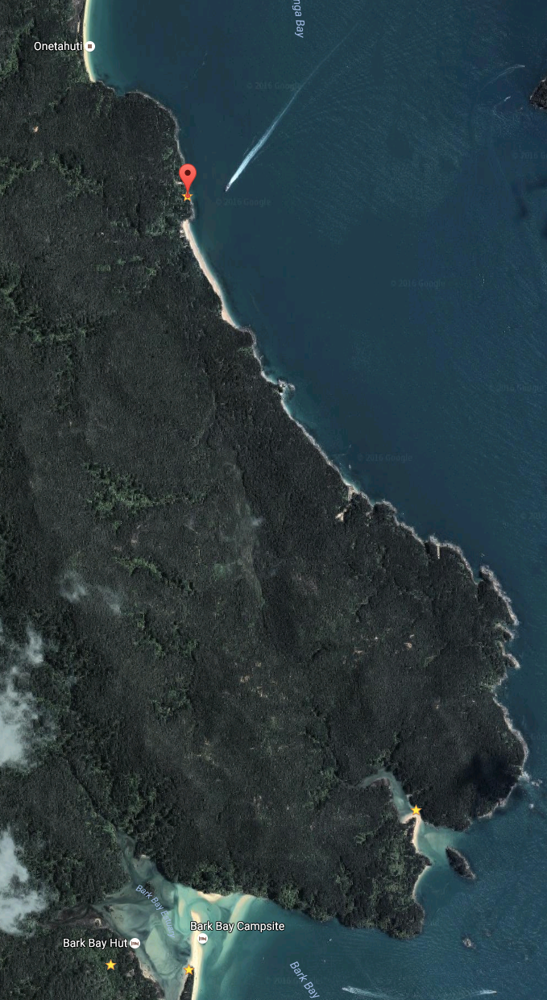

# Tonga Quarry Campsite

Walk-in or boat-in to this beachside campsite on the Mosquito Bay to Awaroa section of the Abel Tasman Coast Track. There is no drive on access.

The attractive Tonga Quarry campsite is adjacent to a beach that is more intimate than the larger Bark Bay campsite or even Onetahuti. There’s a few artifacts remaining from the days when it was actually a quarry, ie, over 100 years ago, the Nelson Cathedral steps were extracted from here.

Details:
* Booking: Required
* Cost: $14/night
* Sites: 10
* Location: NZTM2000 coordinates: E1604265, N5472978 -- Latitude: 40 53 39.391 S, Longitude: 173 03 02.275 E
* Facilities: picnic tables - longdrop
* Fire: No

Contact: [Nelson Visitor Centre](contacts.md#nelson-visitor-centre)

### Grounds

### Topo Map

### Google Earth

## Related Links
* http://www.doc.govt.nz/parks-and-recreation/places-to-go/nelson-tasman/places/abel-tasman-national-park/things-to-do/campsites/tonga-quarry-campsite/
* http://www.tramping.net.nz/huts-abel-tasman-coastal/tonga-quarry-campsite-coastal-track-abel-tasman
