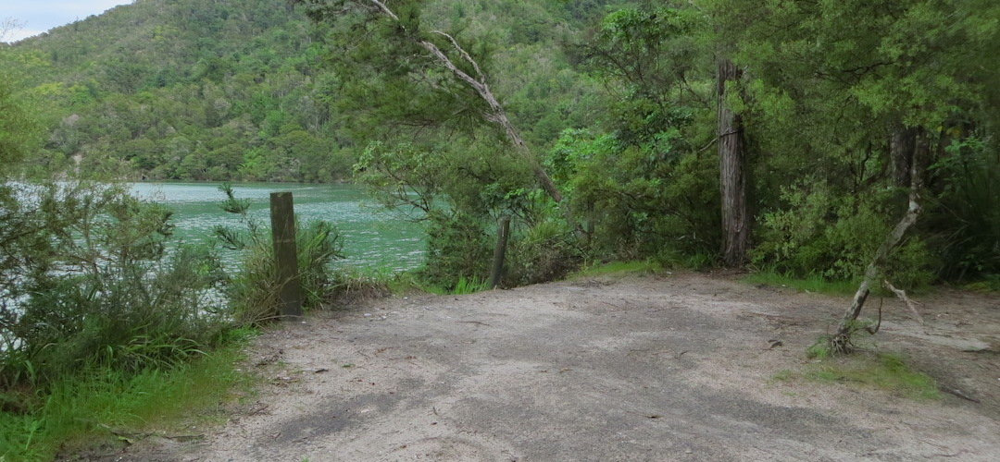
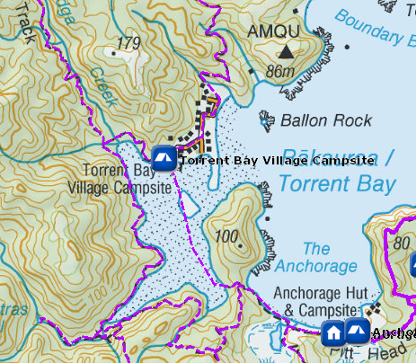
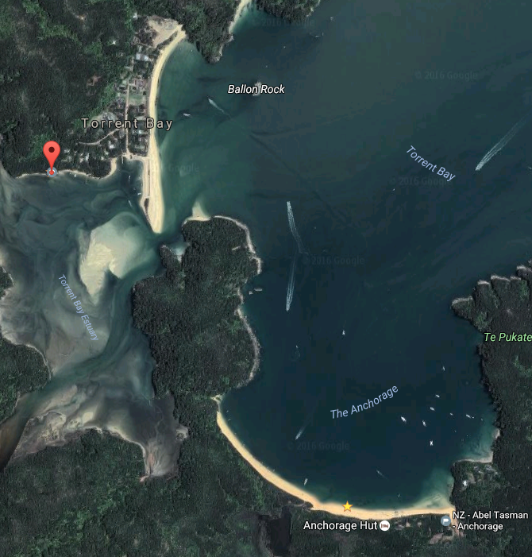

# Torrent Bay Village Campsite

Walk-in or boat-in to this campsite on the Torrent Bay Estuary to Bark Bay section of the Abel Tasman Coast Track. There is no drive on access.

Situated beside a tidal estuary, the Torrent Bay Village Campsite is five minutes from a scheduled water taxi stop.

Adjacent to the Torrent Bay estuary which is either tide in, or tide out, this is a no frills campsite close to the Torrent Bay Village, which other than a few baches has few actual village qualities.

Details:
* Booking: Required
* Cost: $14/night
* Sites: 10
* Location: NZTM2000 coordinates: E1603859, N5467048 -- Latitude: 40 56 51.708 S, Longitude: 173 02 45.055 E
* Facilities: picnic table -- tap on post, treating water recommended -- flush toilet
* Fire: No

Contact: [Nelson Visitor Centre](contacts.md#nelson-visitor-centre)

### Grounds

### Topo Map

### Google Earth

## Related Links
* http://www.doc.govt.nz/parks-and-recreation/places-to-go/nelson-tasman/places/abel-tasman-national-park/things-to-do/campsites/torrent-bay-village-campsite/
* http://www.tramping.net.nz/huts-abel-tasman-coastal/torrent-bay-village-campsite-coastal-track-abel-tasman