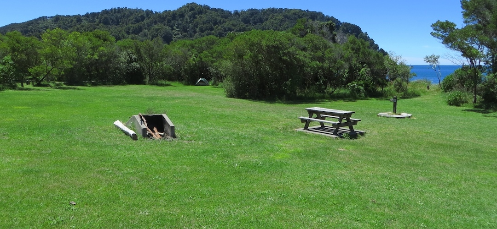
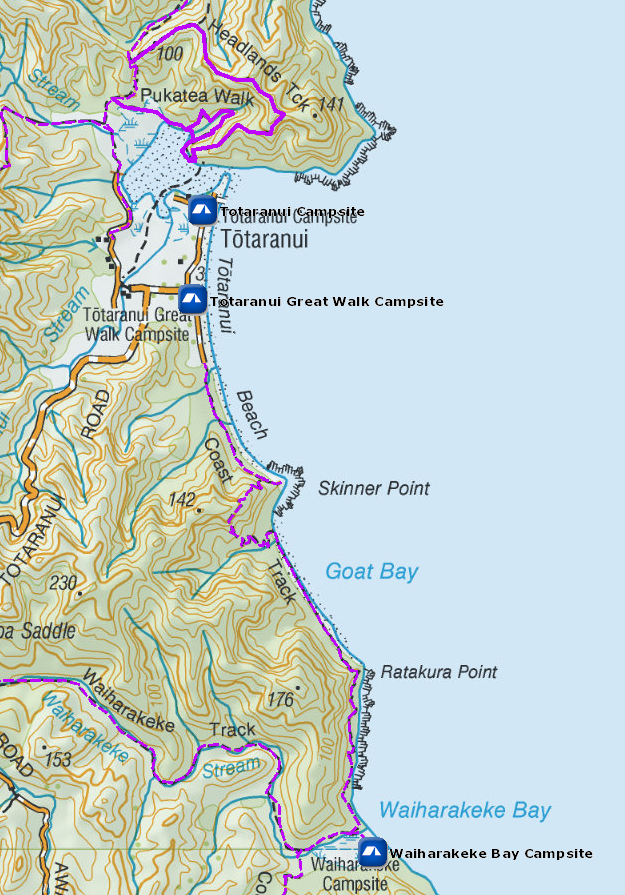
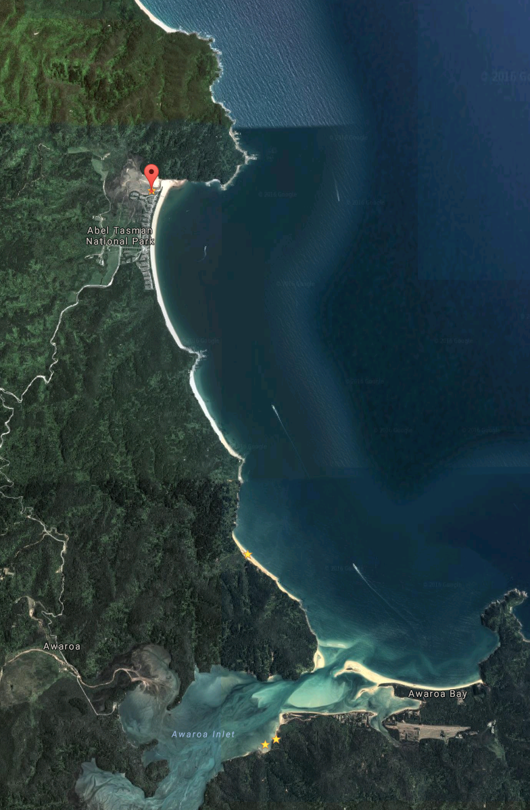

# Totaranui Great Walk Campsite

Walk-in or boat-in to this beachside campsite on the Waiharakeke to Whariwharangi section of the Abel Tasman Coast Track. It is only available for booking for people walking the Coastal Track.

Totaranui Great Walk campsite is a scheduled water taxi stop. There is also vehicle access and parking within 100 m from the campsite.

The campsite contains a fireplace and has hand-washing sinks.

Totaranui has a massive summer campsite, like 870 playful campers in peak season, but there is a section set aside for walkers. The hitch is that you are only allowed to stay at Totaranui Great Walk campsite one night.

The beach is great, the campsite just a little too sloping for full comfort.

Details:
* Booking: Required
* Cost: $14/night
* Sites: 10
* Location: NZTM2000 coordinates: E1600414, N5481379 -- Latitude: 40 49 06.983 S, Longitude: 173 00 17.673 E
* Facilities: steel benchtop - sink with tap, filtered water - flush toilet
* Fire: Yes

Contact: [Nelson Visitor Centre](contacts.md#nelson-visitor-centre)

### Grounds

### Topo Map

### Google Earth

## Related Links
* http://www.doc.govt.nz/parks-and-recreation/places-to-go/nelson-tasman/places/abel-tasman-national-park/things-to-do/campsites/totaranui-great-walk-campsite/
* http://www.tramping.net.nz/huts-abel-tasman-coastal/totaranui-great-walk-campsite-coastal-track-abel-tasman
