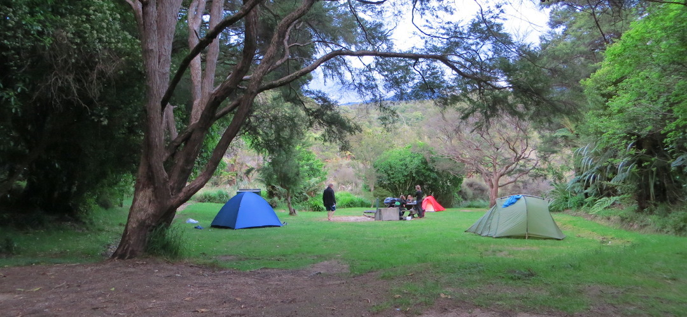
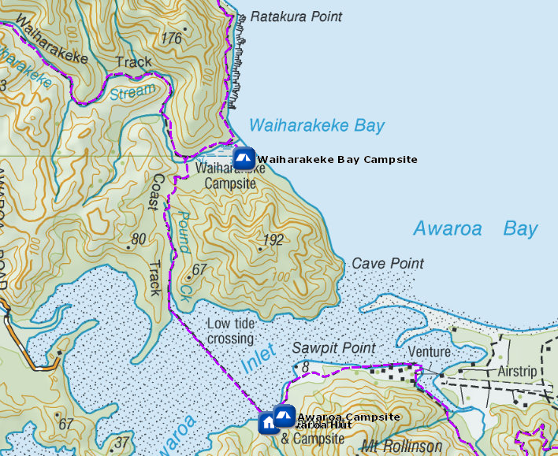
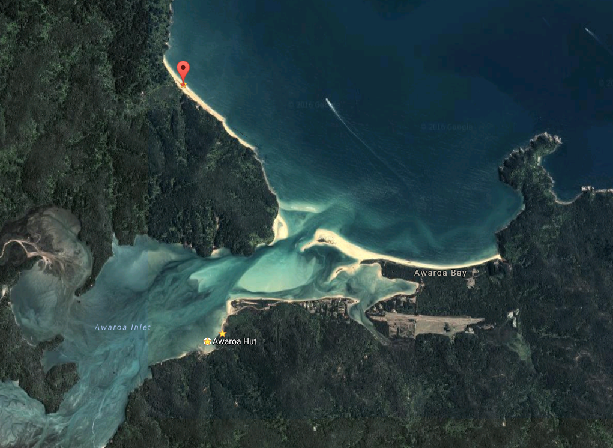

# Waiharakeke Bay Campsite

Walk-in or boat-in to this campsite on the Waiharakeke to Whariwharangi section of the Abel Tasman Coast Track. There is no drive on access.

Waiharakeke Bay campsite is a sheltered site that though called Waiharakeke Bay is not so close to the beach, once again has too much slope for not slipping down the hill in the night.

Details:
* Booking: Required
* Cost: $14/night
* Sites: 10
* Location: NZTM2000 coordinates: E1601314, N5477980 -- Latitude: 40 50 57.212 S, Longitude: 173 00 56.118 E
* Facilities: steel benchtop - sink with tap, filtered water - flush toilet
* Fire: Yes

Contact: [Nelson Visitor Centre](contacts.md#nelson-visitor-centre)

### Grounds

### Topo Map

### Google Earth

## Related Links
* http://www.doc.govt.nz/parks-and-recreation/places-to-go/nelson-tasman/places/abel-tasman-national-park/things-to-do/campsites/waiharakeke-bay-campsite/
* http://www.tramping.net.nz/huts-abel-tasman-coastal/waiharakeke-bay-campsite-coastal-track-abel-tasman#