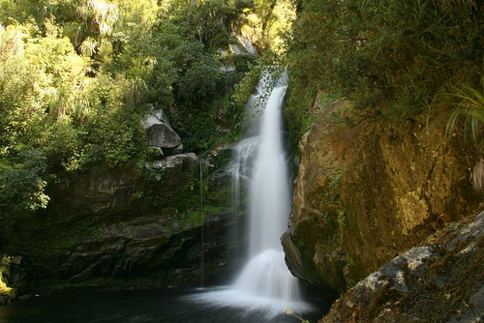
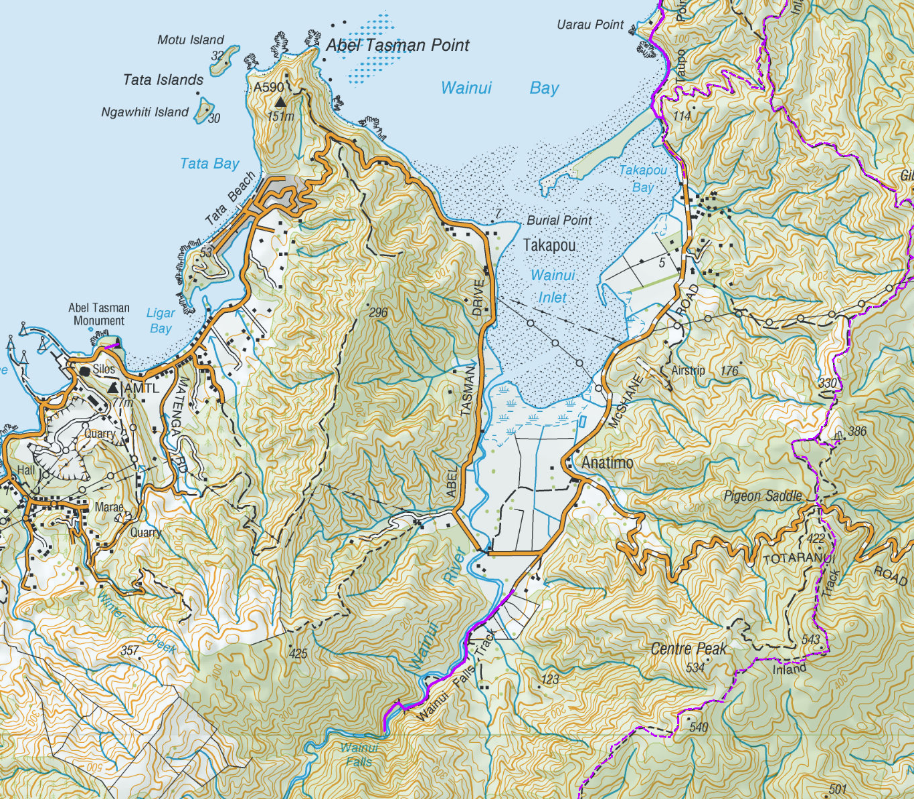
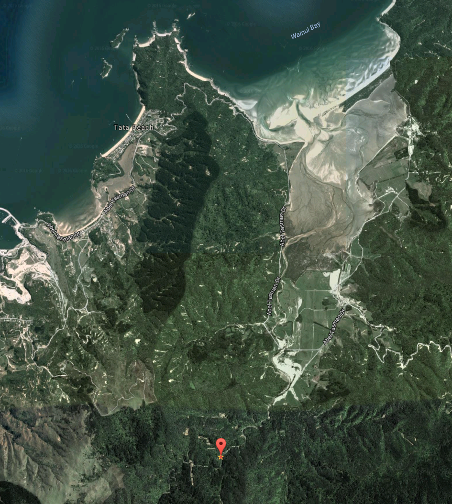

# Wainui Falls Track

From the carpark the track crosses farmland for a short distance before entering forest and climbing rapidly to a point where you see the river surprisingly far below.

Here you walk through a forest of nikau palms, rata trees and ferns. Keep a lookout for a possible sighting of the giant snail, Powelliphanta. Look but don't touch!

A few minutes after crossing the swing bridge over the Wainui River you will hear the falls before they suddenly appear, usually curtained in spray.

The track starts from a carpark in Wainui Bay, 20 km north-east from Takaka. Look for the direction sign on the road side approximately 300 metres after crossing over the Wainui River Bridge.

* Distance: 1.5km
* Duration: 30 minutes
* Difficulty: Easy
* Location: S 40° 50.922' E 172° 55.701'

### Falls

### Topo Map

### Google Earth

## Related Links
* http://www.doc.govt.nz/parks-and-recreation/places-to-go/nelson-tasman/places/abel-tasman-national-park/things-to-do/tracks/wainui-falls-track/?region=nelsontasman&park=dc9bb314-c503-41f3-b68a-fd0f6def602b&activity=walking-tramping#activitypanel
* https://www.tripadvisor.com/ShowUserReviews-g2397656-d6631356-r250434941-Wainui_Falls-Pohara_Golden_Bay_Nelson_Tasman_Region_South_Island.html
* http://waterfalls.co.nz/waterfalls-by-region/224-new-zealand-waterfalls/south-island/tasman/abel-tasman-national-park/254-wainui-falls
