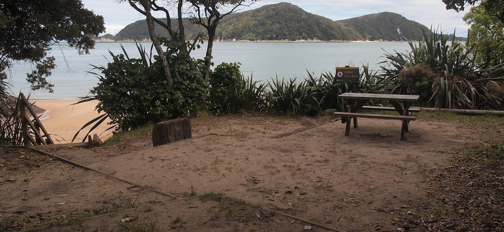
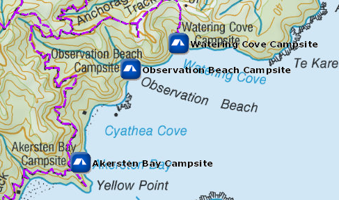
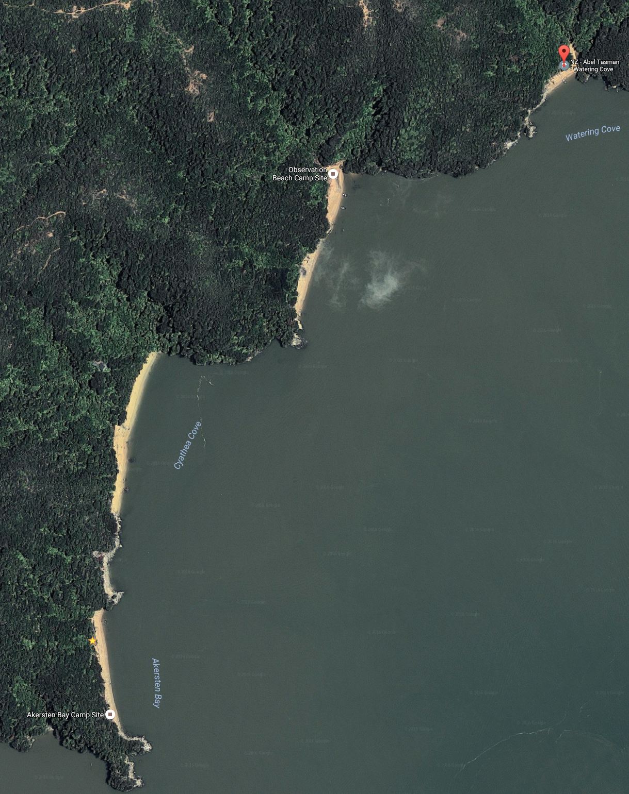

# Watering Cove Campsite

Walk-in or boat-in to this beachside campsite on the Tinline to Anchorage section of the Abel Tasman Coast Track. There is no drive on access.

Details:
* Booking: Required
* Cost: $14/night
* Sites: 5
* Location: NZTM2000 coordinates: E1604737, N5465252 -- Latitude: 40 57 49.937 S, Longitude: 173 03 22.658 E
* Facilities: picnic table -- tap on post, treating water recommended -- longdrop
* Fire: No

Contact: [Nelson Visitor Centre](contacts.md#nelson-visitor-centre)

### Grounds

### Topo Map

### Google Earth

## Related Links
* http://www.doc.govt.nz/parks-and-recreation/places-to-go/nelson-tasman/places/abel-tasman-national-park/things-to-do/campsites/watering-cove-campsite/
* http://www.tramping.net.nz/huts-abel-tasman-coastal/watering-cove-campsite-coastal-track-abel-tasman