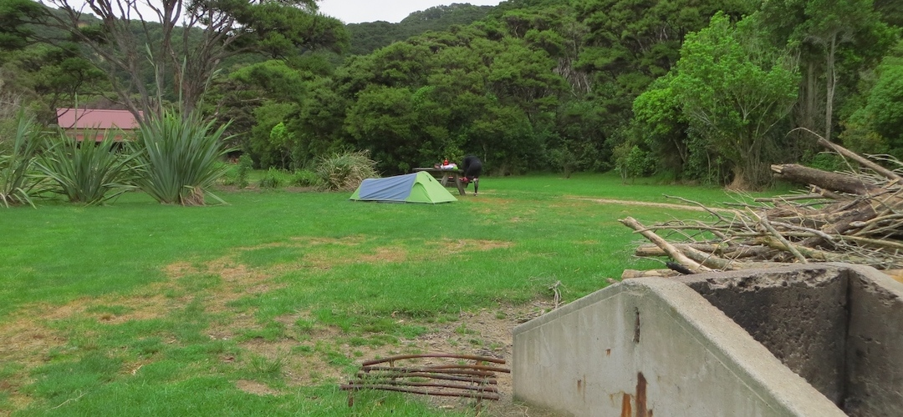
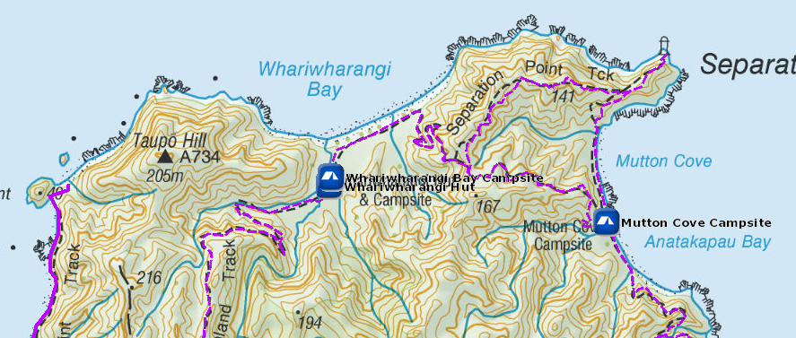
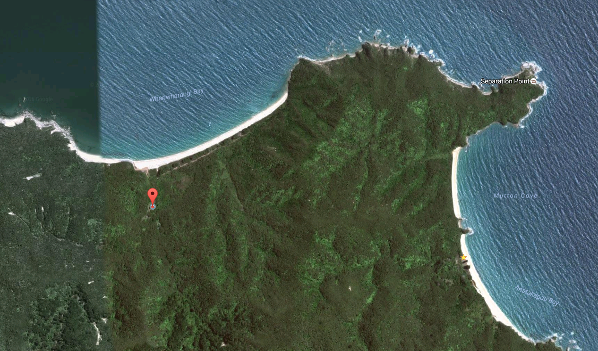

# Whariwharangi Bay Campsite

Walk-in or boat-in to this campsite on the Waiharakeke to Whariwharangi section of the Abel Tasman Coast Track. There is no drive-in access.

Whariwharangi Bay campsite is adjacent to the historic Whariwharangi Bay Hut and a short walk from the beach, the campsites are sheltered and catch all day sun, if the sun is out.

Details:
* Booking: Required
* Cost: $14/night
* Sites: 20
* Location: NZTM2000 coordinates: E1597870, N5484718 -- Latitude: 40 47 18.687 S, Longitude: 172 58 29.113 E
* Facilities: steel bench - tap on post, treating water recommended - flush toilet
* Fire: Yes

Contact: [Nelson Visitor Centre](contacts.md#nelson-visitor-centre)

### Grounds

### Topo Map

### Google Earth

## Related Links
* http://www.doc.govt.nz/parks-and-recreation/places-to-go/nelson-tasman/places/abel-tasman-national-park/things-to-do/campsites/whariwharangi-bay-campsite/
* http://www.tramping.net.nz/huts-abel-tasman-coastal/whariwharangi-bay-campsite-coastal-track-abel-tasman
