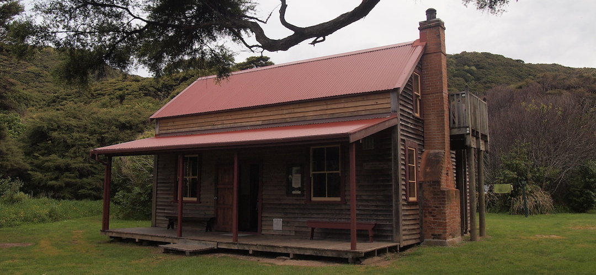
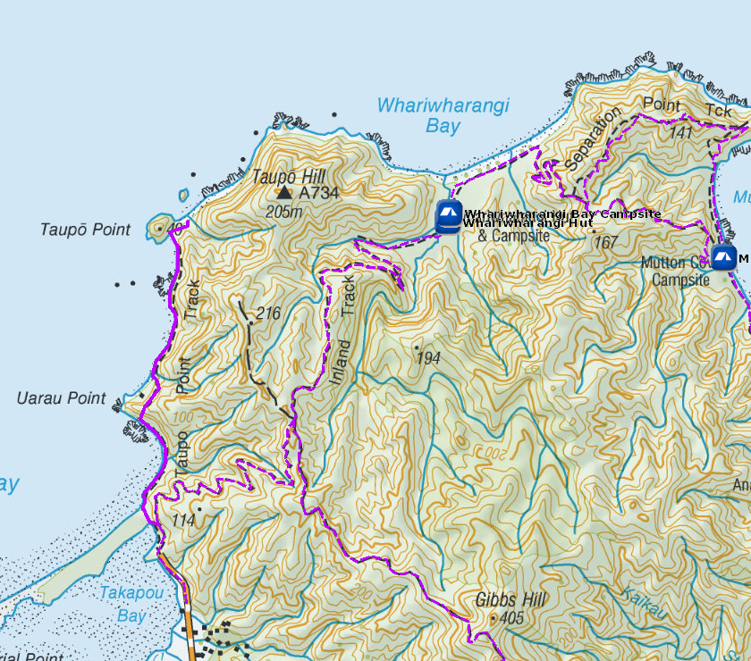
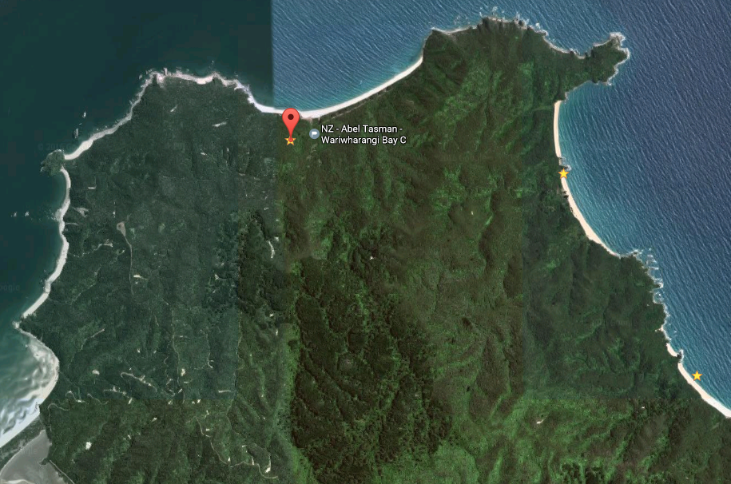

# Whariwharangi Bay Hut

Sited in a grassy clearing in regenerating bush Whariwharangi Hut is the most northern Great Walk Hut on the Abel Tasman Track. Built around 1896, this historic hut was restored in 1980 and it is now available as a tramping hut.

Huts on the Abel Tasman Coast Track don't have gas cooking facilities and lighting. Remember to take a portable stove and fuel, and candles with you.

The historic, ie, around 1896, original farmhouse, now Whariwharangi Bay Hut, has been converted into cosy and comfortable tramper’s accommodation in this less travelled northern section of Abel Tasman.

Details:
* Booking: Required
* Cost: $32/night
* Sites: 20
* Location: NZTM2000 coordinates: E1597715, N5484678 -- Latitude: 40 47 19.982 S, Longitude: 172 58 22.501 E
* Facilities: shelter - tap above sinks, filtered water avaialble - flush toilet
* Fire: Yes

Contact: [Nelson Visitor Centre](contacts.md#nelson-visitor-centre)

### Grounds

### Topo Map

### Google Earth

## Related Links
* http://www.doc.govt.nz/parks-and-recreation/places-to-go/nelson-tasman/places/abel-tasman-national-park/things-to-do/huts/whariwharangi-hut/
* http://www.tramping.net.nz/huts-abel-tasman-coastal/whariwharangi-bay-hut-coastal-track-abel-tasman