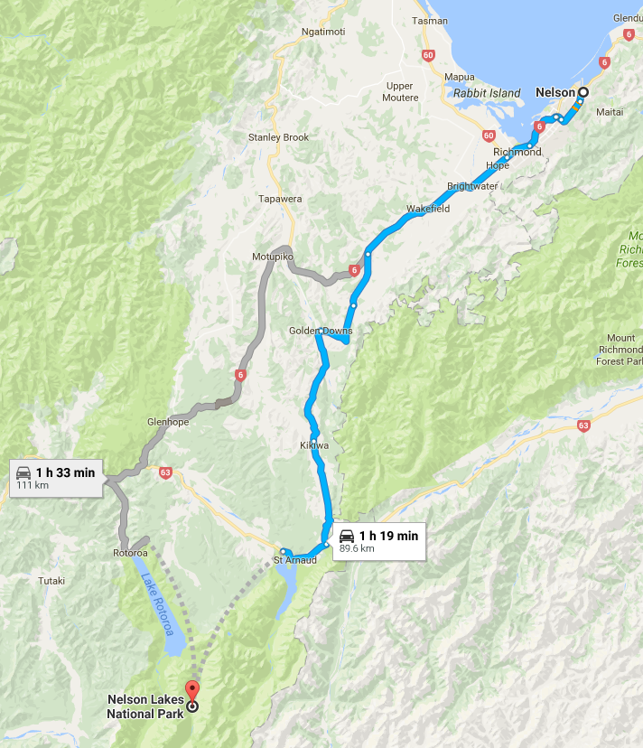

# Nelson Lakes National Park

Nelson Lakes National Park is situated in the north of New Zealand's South Island. The gateway to the park is St Arnaud, a 1-2 hour drive from Nelson or Blenheim.

## One Day Hiking

* [Flower Brothers Walk - TODO](flower-brothers-walk.md)
* [Lake Rotoiti Circuit - TODO](lake-rotoiti-circuit.md)
* [Lake Rotoiti Walking Tracks - TODO](lake-rotoiti-walking-tracks.md)
* [Mount Robert Circuit - TODO](mount-robert-circuit.md)
* [Speargrass Track - TODO](speargrass-track.md)
* [St Arnaud Range Track - TODO](st-arnaud-range-track.md)
* [Whisky Falls - TODO](whisky-falls.md)

## Multi-Day Hiking

* [Angelus Hut Tracks - TODO](angelus-hut-tracks.md)
* [Travers-Sabine Circuit - TODO](travers-sabine-circuit.md)

## Location

You will find Nelson Lakes National Park in the north of the South Island. The gateway to the park is St Arnaud, a picturesque village just 1.5 hours drive from Nelson or Blenheim.

St Arnaud and Lake Rotoiti are accessed by State Highway 63 from Blenheim. A side road, about half way between St Arnaud and Murchison leads to Lake Rotoroa.

Bus services to St Arnaud operate on an irregular basis. Phone the Nelson Lakes Visitor Centre for more information. 

Water taxis operate on both lakes.

Several companies offer on-demand transport to Rotoroa from St Arnaud and Nelson.

* Nelson - ~90km (1h 19m) - [Directions](https://goo.gl/maps/w23wY4EE6dJ2)

## Contact

[Rotoiti/Nelson Lakes Visitor Centre](contacts.md)

## Related Links

* http://www.doc.govt.nz/parks-and-recreation/places-to-go/nelson-tasman/places/nelson-lakes-national-park/
* https://goo.gl/maps/w23wY4EE6dJ2
